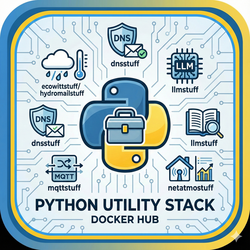

[](https://github.com/vroomfondel/somestuff/actions/workflows/mypynpytests.yml)
[](https://github.com/vroomfondel/somestuff/actions/workflows/buildmultiarchandpush.yml)


[](https://github.com/vroomfondel/somestuff)

# somestuff

Various small but useful Python utilities, experiments, and scripts collected in one place. Some are stand‑alone command‑line tools, others are small libraries or demo apps. A Docker image is provided to bundle the collection for easy, reproducible execution on multiple CPU architectures.

Quick links:
- Project Docker image: built from the repo‑root `Dockerfile` and published via multi‑arch builds
- CI: mypy + pytest, and a multi‑arch Docker build/push workflow (see badges above)

Contents overview (Python packages/modules):
- `dinogame`: pathfinding/visualization playground inspired by “The Farmer Was Replaced”
- `dnsstuff`: SPF resolution helper and ipset updater for allow‑listing email senders (e.g. pcbway.com)
- `ecowittstuff`: simple client/types for Ecowitt weather station API
- `hydromailstuff`: assemble and send “hydro”/weather summary emails, pulling data from MQTT/Netatmo
- `llmstuff`: helpers for working with LLM APIs and local OCR
- `mqttstuff`: tiny MQTT wrapper utility
- `netatmostuff`: Netatmo data fetch helper and deployment example
- Root helpers: `Helper.py`, configs (`config.yaml`, `config.py`, optional `config.local.yaml`), scripts


## Getting started

Local prerequisites:
- Python 3.14+ recommended (repo and Docker image currently use `python:3.14-trixie`)
- `pip` and a virtualenv of your choice

Install dependencies:
```bash
python -m venv .venv
source .venv/bin/activate
pip install -r requirements.txt -r requirements-dev.txt
```

Configuration:
- `config.yaml` contains sample/defaults. Do not commit secrets. If needed, create `config.local.yaml` to override locally (kept out of the image by default). Some modules read credentials/API keys from here (e.g. Ecowitt, Netatmo, MQTT, email settings). Adjust as needed before running modules that require it.

Run tests and type checks:
```bash
pytest -q
mypy .
```


## Modules and their usefulness

### dinogame
Pathfinding toy project and visualization to prototype search/planning strategies on a grid world, loosely inspired by “The Farmer Was Replaced”. Useful to experiment with A* heuristics and safe‑move constraints while visualizing planning vs execution.

- Entrypoint example: `dinogame/dinogame.py` contains a `main()` that renders a GIF of a planning/execution sequence.
- Requirements: `matplotlib`, `numpy` (already in `requirements.txt`).
- Run locally:
```bash
python -m dinogame.dinogame
```
This saves an animated GIF (via pillow) to your desktop by default; see code comments to tweak world size and frame count.


### dnsstuff (pcbwaydnsstuff)
Script to crawl SPF records (including nested `include:` chains) for one or more domains, resolve them to IPv4 ranges/addresses, then update an `ipset`. The ipset can be used by your MTA/firewall to allowlist specific SMTP sources. Originally motivated by receiving mails from pcbway.com while using country‑based IP blocks.

- CLI usage:
```bash
python -m dnsstuff.pcbwaydnsstuff pcbway.com mail-notify.pcbway.com
```
- Behavior:
  - Prints resolved IPv4s to stdout for each domain and combined total.
  - If running as root (`UID 0`), updates/swap‑refreshes an ipset named `smtpallowlist` (configurable in code) using `pyroute2.ipset`.
  - If not root, it only reports and skips the ipset update step.
- Dependencies: `dnspython`, `pyroute2`.
- Usefulness: automate building an SMTP allowlist from domains you trust, keeping it fresh even with complex SPF chains.


### ecowittstuff
Small client types and functions to call the Ecowitt API and parse real‑time weather data into typed models.

- Main bits: `ecowittstuff/ecowittapi.py` defines `pydantic` models (e.g. `WeatherStationResponse`) and `get_realtime_data()`.
- Config required: `ecowitt.application_key`, `ecowitt.api_key`, `ecowitt.mac`, URLs in `config.yaml`.
- Example:
```bash
python -c "from ecowittstuff.ecowittapi import get_realtime_data; print(get_realtime_data())"
```
- Usefulness: convenient, typed access to your Ecowitt station’s real‑time metrics for dashboards, alerts, and reports.


### hydromailstuff
Compose and send a status email summarizing recent measurements (e.g., water level, rain totals, ambient data). Pulls latest values from MQTT topics and Netatmo.

- Entrypoint: `hydromailstuff/hydromail.py` → `do_main_stuff()`.
- Needs config: email settings, MQTT (`mqtt.*`), and Netatmo credentials under `netatmo.*` in `config.yaml`.
- There are example deployment/cron YAMLs in `hydromailstuff/somestuff_hydromail_cronjob.yml`.
- Usefulness: periodic email digests for environmental monitoring.


### llmstuff
Helper utilities to interact with LLM providers or local OCR pipelines.

- Files: `llmstuff/llmhelper.py`, `llmbatchhelper.py`, `ollamadeepseekocr.py`.
- Config: keys under `google.*` and `anthropic.*` in `config.yaml` if you want to call those providers.
- Usefulness: quick building blocks when experimenting with LLMs and OCR.


### mqttstuff
Minimal MQTT wrapper(s) and helpers.

- File: `mqttstuff/mosquittomqttwrapper.py`.
- Config: `mqtt.*` and `mqtt_topics.*` in `config.yaml` (topics include metadata such as subscribe flag and default metadata).
- Usefulness: standardize how topics are named and read/published across scripts.
- **⚠️ Warning:** this is now an external module (https://github.com/vroomfondel/mqttstuff) and included as library via pypi (https://pypi.org/project/mqttstuff/)


### netatmostuff
Read Netatmo measurements and provide a deployment example.

- Files: `netatmostuff/lnetatmo.py`, deployment example `somestuff_netatmo_deployment.yml`.
- Config: `netatmo.username/password/client_id/client_secret` (and optional module IDs) in `config.yaml`.
- Usefulness: sourcing outdoor temperature, rainfall, pressure, etc., for dashboards or mail digests.


### Root helpers and configuration

- `Helper.py`: JSON helpers including a `ComplexEncoder` to serialize datetimes, UUIDs, and custom objects with `repr_json()`/`as_string()`.
- `config.py`: config loader/merger; use `config.local.yaml` to keep secrets out of VCS and override defaults.
- `scripts/update_badge.py`: helper used in CI to update the clones badge.
- `tests/`: basic test scaffold.


## Docker: build process, use, and usefulness

There is a single Docker image defined by the repo‑root `Dockerfile`. The image:
- Uses `python:3.14-trixie` base (commented alternatives exist for 3.13/ PyPy).
- Installs a few system tools (`htop`, `dnsutils`, `tini`, etc.) and Python deps via `requirements.txt`.
- Creates a non‑root user (`pythonuser`, configurable via build args `UID`, `GID`, `UNAME`).
- Copies the packages into `/app` and sets `PYTHONPATH` accordingly.
- Accepts build‑time metadata args and exports them as envs: `GITHUB_REF`, `GITHUB_SHA`, `BUILDTIME`.
- Entrypoint is `tini --`, default `CMD` tails the log (adjust for your workload).

Why this is useful:
- Reproducible environment across machines/architectures.
- Non‑root execution by default improves container security.
- Multi‑arch support (amd64 + arm64) for running on laptops, servers, and SBCs alike.

### Local build (simple)
```bash
docker build \
  --build-arg buildtime="$(date +'%Y-%m-%d %H:%M:%S %Z')" \
  -t xomoxcc/somestuff:py314trixie \
  .
```

Run interactively (example):
```bash
docker run --rm -it \
  -v $(pwd)/config.yaml:/app/config.yaml:ro \
  xomoxcc/somestuff:py314trixie \
  python -m dnsstuff.pcbwaydnsstuff pcbway.com
```

### Local build and multi‑arch push via buildx
This repo includes a helper script `build.sh` that:
- Logs in (expects `DOCKER_TOKENUSER` and `DOCKER_TOKEN` in env on first run)
- Ensures a `buildx` builder exists (and installs binfmt/qemu if needed)
- Builds locally and also performs a `docker buildx build --platform linux/amd64,linux/arm64 --push` with tags
- Writes local build logs to `docker_build_local.log`

Usage:
```bash
./build.sh            # multi‑arch build & push
./build.sh onlylocal  # local build only (no push)
```

The script also sets `DOCKER_CONFIG` to the bundled `docker-config/` directory so the builder state is isolated per‑repo. The primary tag is `xomoxcc/somestuff:py314trixie` and an additional `:latest` tag is automatically added if missing.

### GitHub Actions
- `.github/workflows/buildmultiarchandpush.yml` builds and pushes multi‑arch images on CI.
- `.github/workflows/mypynpytests.yml` runs mypy + pytest.
- `.github/workflows/checkblack.yml` checks code style.
- `.github/workflows/update-clone-badge.yml` updates the clones badge.


## Python 3.14 JIT experiment (sub‑project)
There is a dedicated subfolder `python314jit/` with its own `Dockerfile`, `build.sh`, and `README.md` for experimenting with Python 3.14’s new features and performance. See `python314jit/README.md` for details.

[https://hub.docker.com/r/xomoxcc/python314-jit/tags](https://hub.docker.com/r/xomoxcc/python314-jit/tags)

## Versioning
This is a living collection; no strict semantic versioning. Expect occasional breaking changes. A rough, humorous version might be “-0.42”.


## License
This project is licensed under the LGPL where applicable/possible — see [LICENSE.md](LICENSE.md). Some files/parts may use other licenses: [MIT](LICENSEMIT.md) | [GPL](LICENSEGPL.md) | [LGPL](LICENSELGPL.md). Always check per‑file headers/comments.


## Authors
- Repo owner (primary author)
- Additional attributions are noted inline in code comments


## Acknowledgments
- Inspirations and snippets are referenced in code comments where appropriate.


## ⚠️ Note

This is a development/experimental project. For production use, review security settings, customize configurations, and test thoroughly in your environment. Provided "as is" without warranty of any kind, express or implied, including but not limited to the warranties of merchantability, fitness for a particular purpose and noninfringement. In no event shall the authors or copyright holders be liable for any claim, damages or other liability, whether in an action of contract, tort or otherwise, arising from, out of or in connection with the software or the use or other dealings in the software. Use at your own risk.