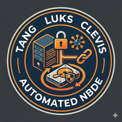

[](https://hub.docker.com/r/xomoxcc/tang/tags)

[](https://hub.docker.com/r/xomoxcc/tang/tags)

# Tang, LUKS, and Clevis: Automated Network-Bound Disk Encryption (NBDE)

This directory provides a comprehensive solution for setting up a **Tang** server and utilizing **Clevis** for automated decryption of **LUKS**-encrypted partitions upon system boot. It is specifically designed for high availability and flexibility using modern container orchestration patterns.


## Table of Contents
1. [Architecture Overview](#architecture-overview)
2. [Tang Server Container](#tang-server-container)
    - [Container Features & Process Management](#container-features--process-management)
    - [Configuration (Environment Variables)](#configuration-environment-variables)
    - [Docker Usage](#docker-usage)
3. [Deployment (Kubernetes / k3s)](#deployment-kubernetes--k3s)
    - [Service & Routing](#service--routing)
    - [Security Middlewares](#security-middlewares)
4. [Client Setup (LUKS & Clevis)](#client-setup-luks--clevis)
    - [Prerequisites](#prerequisites)
    - [Encryption Workflow](#encryption-workflow)
    - [Automated Decryption](#automated-decryption)
5. [Maintenance & Troubleshooting](#maintenance--troubleshooting)
    - [Connectivity Checks](#connectivity-checks)
    - [Security Notes](#security-notes)

---

## Architecture Overview

Network-Bound Disk Encryption (NBDE) allows for secure, automated unlocking of encrypted drives when the system is connected to a trusted network.

- **LUKS (Linux Unified Key Setup)**: The standard disk encryption layer for Linux.
- **Tang**: A stateless, lightweight server that facilitates network-bound key exchange. It doesn't store keys; it derives them.
- **Clevis**: A decryption framework that resides on the client. It uses "pins" (like Tang or TPM2) to automatically unlock LUKS volumes.
- **s6-overlay**: Used within the container to manage multiple processes (Tang, HAProxy, Nginx) reliably.

---

## Tang Server Container

The provided [Dockerfile](Dockerfile) builds a robust Tang server image based on Debian Trixie.

### Container Features & Process Management

- **s6-overlay (v3)**: We use [s6-overlay](https://github.com/just-containers/s6-overlay) for clean process supervision. It ensures that if the Tang server, HAProxy, or Nginx crashes, they are automatically restarted.
- **Integrated Frontends**: 
    - **HAProxy**: Provides a high-performance TCP/HTTP load balancer. It's configured to support the PROXY protocol, allowing the Tang server to see the real client IP even when behind another load balancer.
    - **Nginx**: Can be used as an alternative frontend or for serving static content/logs.
- **Configuration Templates**: Both HAProxy and Nginx use `.pre` template files. At startup, `envsubst` populates these templates with environment variables, creating the final configuration files.
- **Security**: 
    - **iptables Isolation**: When `USENGINX` or `USEHAPROXY` is enabled, the container can use `iptables` (requires `--cap-add=NET_ADMIN`) to block direct external access to the `TANGPORT`, forcing all traffic through the configured frontend.
- **Multi-Architecture**: The build script [build.sh](build.sh) supports building for both `amd64` and `arm64`.

### Configuration (Environment Variables)

The container's behavior is highly configurable:

| Variable | Default | Description |
| :--- | :--- | :--- |
| `TANGPORT` | `9090` | Internal port where `tangd` listens. |
| `TANGDATADIR` | `/var/lib/tang` | Directory where Tang keys are stored. |
| `USEHAPROXY` | `1` | Enable/Disable HAProxy (1 to enable, 0 to disable). |
| `HAPROXYPORT` | `80` | Port HAProxy listens on. |
| `HAPROXYACCEPTPROXY`| `1` | Enable PROXY protocol support in HAProxy (`accept-proxy`). |
| `USENGINX` | `0` | Enable/Disable Nginx (1 to enable, 0 to disable). |
| `NGINXPORT` | `80` | Port Nginx listens on. |
| `NGINXACCEPTPROXY` | `1` | Enable PROXY protocol support in Nginx (`proxy_protocol`). |

### Docker Usage

**Build:**
```bash
./build.sh
```

**Run (with HAProxy and PROXY protocol):**
```bash
docker run -it --cap-add=NET_ADMIN -p 9090:80 \
  -e TANGDATADIR=/var/lib/tang \
  -e USEHAPROXY=1 \
  -e HAPROXYPORT=80 \
  -e HAPROXYACCEPTPROXY=1 \
  -v $(pwd)/TANGDATA:/var/lib/tang \
  --rm xomoxcc/tang:latest
```
*Note: The `TANGPORT` (default 9090) is protected by iptables inside the container if a frontend is used.*

---

## Deployment (Kubernetes / k3s)

For production-grade deployments, the [`k3s_tang_deployment.yml`](k3s_tang_deployment.yml) file provides a complete manifest.

### Service & Routing

The deployment includes:
- **Deployment**: Single replica (stateless, but keys must be persisted).
- **Service**: A standard ClusterIP service exposing port `9090`.
- **IngressRoute (Traefik)**: Defines how external traffic reaches the service. It uses advanced matching rules:
  - `Host('tang.example.com')`
  - `Query('action=tang')` (as a "breadcrumb" for custom routing logic)

### Security Middlewares

To protect the Tang server from unauthorized network access at the ingress level:
- **Middleware (IP Allow-List)**: A Traefik `Middleware` is defined to restrict access to specific IP ranges (e.g., your local network or VPN).
- **InitContainer**: A small init container ensures the persistent volume at `/var/lib/tang` has the correct ownership (`_tang` user) before the main server starts.

---

## Client Setup (LUKS & Clevis)

Instructions optimized for Ubuntu 25.10.

### Prerequisites

Install the necessary client packages:
```bash
sudo apt update
sudo apt install cryptsetup clevis clevis-luks clevis-initramfs clevis-systemd
```

### Encryption Workflow

If you are migrating an existing LVM partition (e.g., `/dev/mapper/vg0-lv_data`):

1. **Backup & Rename**:
   ```bash
   sudo umount /path/to/data
   sudo lvrename vg0 lv_data lv_data_old
   ```
2. **Create & Format New Volume**:
   ```bash
   sudo lvcreate -L 10G -n lv_data vg0
   sudo cryptsetup luksFormat /dev/mapper/vg0-lv_data
   sudo cryptsetup open /dev/mapper/vg0-lv_data data_crypt
   sudo mkfs.ext4 /dev/mapper/data_crypt
   ```
3. **Data Migration**:
   ```bash
   sudo mount /dev/mapper/data_crypt /path/to/data
   sudo mount /dev/mapper/vg0-lv_data_old /mnt
   sudo rsync -avrlp /mnt/ /path/to/data/
   ```
4. **Configuration Update**:
   - **`/etc/crypttab`**:
     ```text
     data_crypt  UUID=<UUID_OF_VG0_LV_DATA>  none  luks,_netdev
     ```
   - **`/etc/fstab`**:
     ```text
     /dev/mapper/data_crypt  /path/to/data  ext4  defaults,_netdev  0  2
     ```
   *Note: Use `_netdev` to ensure the system waits for network availability.*

### Automated Decryption

Bind the partition to your Tang server(s). Example using Shamir Secret Sharing (SSS) for redundancy (requiring 1 out of 2 servers):

```bash
sudo clevis luks bind -d /dev/mapper/vg0-lv_data sss \
  '{"t":1, "pins":{"tang":[{"url":"http://tang1.local"},{"url":"http://tang2.remote.tld:9090"}]}}'
```

Update initramfs to apply changes:
```bash
sudo update-initramfs -u
```

---

## Maintenance & Troubleshooting

### Connectivity Checks

Use the provided script [`tang_check_connection.sh`](tang_check_connection.sh) to verify your setup:
```bash
sudo ./tang_check_connection.sh /dev/mapper/vg0-lv_data
```
This script tests all Clevis slots by attempting a trial decryption.

### Security Notes

- **Key Persistence**: If you lose the keys in `TANGDATADIR`, you will lose access to your encrypted data unless you have the manual passphrase. **Backup your keys!**
- **Network Trust**: Tang does not authenticate the client. Security relies on the client's ability to reach the server. Use network-level protections (VPNs, VLANs, Firewalls, or the included Traefik Middlewares) to limit who can talk to Tang.
- **Production Warning**: This project demonstrates a secure setup but should be reviewed by your security team. Use at your own risk.